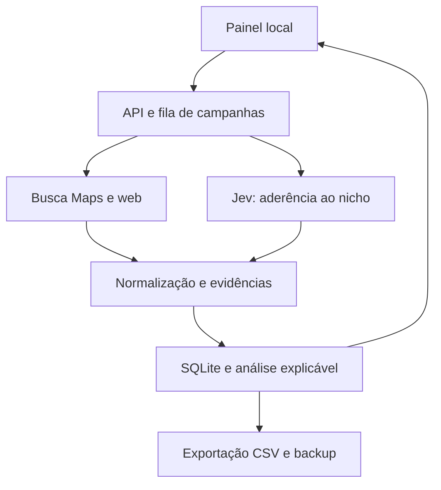

# Radar Local — plano completo do projeto

Versão 1.0 · 8 de outubro de 2026 · Produto local de prospecção para PMEs

## 1. Resultado esperado

Informar um nicho e uma região e receber uma lista priorizada de empresas, com telefone comercial, Instagram quando identificado, endereço, site, dados públicos do perfil e evidências de oportunidades. O agente ajuda a escolher quem pesquisar e abordar; não promete posição no Google, faturamento ou propensão de compra.

Piloto: até 10 lojas de moda feminina em São Carlos–SP. O formulário permite outros nichos, cidades, termos e pontos de busca. O nome Radar Local é provisório e pode ser trocado.

O primeiro entregável é um aplicativo que roda no computador do operador, com painel em português, banco SQLite, coleta por API, qualificação opcional com Jev e exportação CSV. A navegação autônoma com Jev terá uma etapa independente: não é requisito para testar o produto inicial e não será apresentada como funcionando sem validação real.

## 2. Escopo e limites

### Versão inicial

- Criar campanhas com nicho, cidade, serviço oferecido, até três termos e até três pontos geográficos opcionais.
- Consultar Google Maps por um provedor configurado, excluir anúncios e registrar a ordem orgânica observada.
- Coletar nome, categoria, endereço, telefone, site, nota, quantidade de avaliações, coordenadas quando fornecidas e identificadores.
- Buscar candidatos de Instagram em resultados públicos indexados; manter pendente de revisão até confirmação pelo operador.
- Classificar aderência ao nicho com Jev, preservando decisão, confiança, modelo e data.
- Separar indicadores de visibilidade da prioridade comercial.
- Ficha do lead com evidências, observações, status de acompanhamento e fonte.
- Remover duplicações conservadoramente; preservar filiais diferentes.
- Processamento em fila, cancelamento entre chamadas, limite de consultas, erros visíveis e recuperação após reinício.
- Modo de demonstração explicitamente fictício, sem chamadas pagas, e importação de dados próprios.
- Exportar os resultados filtrados para CSV e fazer backup do banco.

### Etapas seguintes

1. Worker de navegador Jev/Playwright com extração validada e teste de rolagem interna no Maps.
2. Verificação de links oficiais, sites e contatos com coleta limitada por domínio e proteção contra URLs maliciosas.
3. Grade geográfica maior e histórico de evolução em várias datas.
4. Calibração da prioridade com resultados reais de prospecção.
5. Múltiplos usuários, banco remoto e execução agendada somente se a operação justificar.

Envio automático de mensagens, negociação, anúncios e acesso a contas privadas não fazem parte desta primeira versão. A lista de leads é entregue para revisão e abordagem do operador. O porte PME é um critério de prospecção, não uma classificação fiscal comprovada pelo Maps.

## 3. Jornada do operador

1. Abrir o painel local e consultar o estado das integrações.
2. Criar campanha; escolher demonstração, coleta real ou importar lista própria.
3. Informar nicho, cidade, serviço, quantidade e termos. Opcionalmente informar pontos latitude/longitude/zoom; sem pontos, o provedor resolve a cidade e a análise é rotulada como regional.
4. Conferir o número máximo previsto de chamadas antes de iniciar.
5. Acompanhar a fila e os resultados parciais. Cancelar impede novas etapas, mas não desfaz uma requisição já enviada.
6. Filtrar por nome, prioridade e estágio de acompanhamento.
7. Abrir a ficha, conferir fontes e confirmar ou rejeitar o candidato de Instagram.
8. Registrar observações, marcar em análise, contatado, interessado, descartado ou não contatar.
9. Exportar a lista e manter backup.

## 4. Dados e qualidade

Cada empresa terá: id interno, identificador da fonte, nome, categoria, cidade, bairro quando disponível, endereço, telefone, site, Instagram candidato, estado de validação do Instagram, nota, quantidade de avaliações e links das fontes. Os dados numéricos ausentes são nulos; não viram zero.

Cada observação de busca terá: campanha, termo, ponto ou cidade, horário UTC, posição orgânica, limite de resultados consultado e fonte. O fuso do painel é America/Sao_Paulo. Todas as decisões devem poder ser explicadas por dados disponíveis.

Deduplicação: identificador de lugar primeiro; quando não existir, nome normalizado + endereço + cidade. Telefones compartilhados não fundem filiais automaticamente. O modo fictício ocupa uma origem separada.

Estados distintos: não informado pela fonte, não localizado na pesquisa, candidato pendente e confirmado pelo operador. Um telefone não é considerado WhatsApp sem evidência. Ausência de URL não comprova inexistência de site. Falha de coleta não comprova problema da empresa.

## 5. Como medir visibilidade

Usar buscas comparáveis por termo, localização, idioma e data. Remover anúncios da ordem orgânica. Guardar posição por observação; a mediana só considera posições efetivamente observadas e deve mostrar o número de amostras.

Regra inicial, escolhida para triagem e não atribuída ao Google:

| Posição mediana observada | Rótulo |
|---|---|
| 1–3 | Presença no topo da amostra |
| 4–10 | Presença intermediária |
| Acima de 10 | Baixa visibilidade na amostra |
| Sem posição válida | Não medida |

Uma única busca gera evidência limitada. Para diagnóstico de visibilidade mais consistente, usar pelo menos 3 termos × 3 pontos, mantendo os parâmetros. Não transformar não aparição em posição fictícia como 100. Não afirmar que a amostra cobre todas as empresas da cidade. Empresas que nunca aparecem na fonte exigem outras fontes de descoberta ou lista própria.

O MVP mostrará observações positivas; o cálculo de cobertura com ausências explícitas entre todas as combinações de pontos e termos é uma melhoria posterior. Isso evita uma falsa medida de cobertura baseada apenas nos resultados em que o lead apareceu.

## 6. Como priorizar comercialmente

A prioridade é uma heurística explicável, versionada como v1. Não representa probabilidade de compra. Três serviços iniciais: presença no Google, criação de site e marketing digital.

| Componente | Pontos máximos | Evidência |
|---|---:|---|
| Aderência ao nicho | 25 | Classificação Jev com confiança suficiente ou correspondência textual conservadora, explicitamente identificada |
| Contato disponível | 15 | Telefone comercial informado ou Instagram confirmado |
| Sinal de necessidade relacionado à oferta | 35 | Posição observada ou site não informado pela fonte, com texto qualificado |
| Avaliações abaixo da mediana da amostra | 15 | Pelo menos cinco empresas comparáveis com contagem conhecida |
| Reputação pública utilizável na triagem | 10 | Nota ≥4 e pelo menos cinco avaliações; sem inferir saúde financeira |

Alta: ≥70; média: 40–69; baixa: <40. Se o nicho for incerto, a prioridade fica em revisão. Se o Jev classificar fora do nicho com confiança suficiente, marcar fora do perfil. Itens sem dados não recebem pontos nem são tratados como defeitos. Mostrar também a completude dos dados e as razões dos pontos.

Para sites, o sinal de necessidade é “fonte não informou site”, não “empresa não tem site”. Para marketing digital, apenas os sinais observáveis de descoberta são usados; conteúdo, engajamento e anúncios não serão inventados. Nunca usar o número de avaliações como evidência isolada de posição.

## 7. Papel do Jev

Jev atua como classificador de perguntas pequenas. Pergunta inicial: esta empresa corresponde ao nicho solicitado? Respostas: corresponde, não corresponde, evidência insuficiente. Decisões com confiança inferior a 0,80 seguem para revisão; o limite precisa ser calibrado no piloto.

Estado enviado: nome, categoria, cidade e descrição disponível. Instruções definem esses textos como dados não confiáveis, não como comandos. A resposta é validada contra o conjunto permitido. Guardar a versão efetiva do modelo; começar com jev-1.13.0, documentado na consulta de 08/10/2026.

Jev não busca informações sozinho, não gera nomes de perfis e não substitui a observação de resultados. Sem chave, a aplicação informa uso de regras locais, sem fingir que chamou IA. Regras não são apresentadas como confiança estatística.

No módulo futuro de navegação, o código oferece ações e elementos observados, Jev escolhe, o executor valida e realiza a ação. Limites: passos, tempo, domínios, custo e bloqueios. Nenhuma saída do modelo será executada como JavaScript ou shell. DONE exige verificação independente do resultado.

## 8. Arquitetura

Implementação inicial: Python 3.11+ com biblioteca padrão no servidor; HTML, CSS e JavaScript no painel; SQLite com WAL, chaves estrangeiras e consultas parametrizadas. Essa escolha reduz instalação para um comando, funciona em Windows e mantém o futuro worker Python de navegador próximo da aplicação. O Next.js do exemplo não é uma exigência do produto.

Aplicação somente em 127.0.0.1, sem publicação externa. O servidor HTTP embutido é adequado ao piloto local, não a um serviço público multiusuário. Não há dependência de assinatura de n8n nem de um framework frontend. Credenciais ficam no .env local e nunca vão para o navegador.

Adaptadores: DataForSEO Maps/Organic para descoberta; TypeSafe para Jev; demonstração offline; importação JSON de dados próprios. URLs externas no painel passam por validação de protocolo. O MVP não faz requisições de servidor para URLs arbitrárias encontradas em páginas.

## 9. Persistência e operações

Tabelas: campaigns, leads, campaign_leads, observations, api_calls, schema_version. Leads guardam dados de contato e histórico manual; relação por campanha guarda análise específica do nicho e da oferta. Observações não se perdem ao atualizar o lead.

Fila de um worker para evitar gastos concorrentes. Estados: queued, running, completed, partial, failed, cancelled, interrupted. Ao reiniciar, campanhas em execução ficam interrompidas; não se repetem cobranças automaticamente. Campanhas já concluídas permanecem disponíveis. Uma nova execução requer nova campanha deliberada.

Cada chamada externa é registrada antes do envio, com status de sucesso, erro ou resultado desconhecido. Sem retry automático para chamadas pagas cuja conclusão seja incerta. Configurar limites de chamadas por campanha e por dia UTC. Custos DataForSEO retornados e tokens Jev são registrados separadamente; valores desconhecidos nunca viram custo zero.

Cancelamento é cooperativo entre requisições. Timeout nas APIs evita travamento infinito. Se a coleta de Maps falhar, preservar resultados anteriores e marcar parcial. Se o enriquecimento falhar, manter dados básicos e avisar. Sem fallback silencioso para exemplos.

## 10. Fontes, armazenamento e privacidade

A API oficial Places tem restrições de armazenamento e atribuição: não será usada como base exportável irrestrita do MVP. A integração DataForSEO exige conta e avaliação das condições aplicáveis de uso e retenção; um intermediário não elimina automaticamente obrigações da fonte original. O plano não presume licença irrestrita só porque o dado é público.

No primeiro piloto, coletar apenas informações comerciais necessárias. Não inferir atributos sensíveis, faturamento ou porte fiscal. A política operacional deve permitir corrigir, excluir e marcar não contatar. Não contatar deve prevalecer em novas campanhas. Backup é local, sem credenciais no arquivo exportado.

Segurança técnica: bind local, conferência de Host/Origin, token antirrequisitação indevida para mutações, limite de payload, escape HTML, URLs apenas HTTP(S), parâmetros SQL, sanitização contra fórmulas no CSV, .env ignorado, nenhuma mensagem enviada a terceiros.

## 11. Custos e limites

Fórmula de esforço por campanha: mapas = termos × pontos; web = até uma busca por empresa selecionada; Jev = até uma classificação por empresa. Para 10 empresas, 3 termos e 3 pontos: até 9 chamadas Maps + 10 web + 10 Jev = 29, sem retries. Pesquisa regional simples: 1 + 10 + 10 = 21. APIs podem faturar por profundidade ou resultados, não apenas por chamada.

Não será prometido custo mensal fixo antes de verificar a conta, o preço vigente e o consumo real. O painel informa chamadas e custos devolvidos pelo provedor; o controle inicial confiável é o limite de chamadas. Custo Jev pode ser estimado por tokens com tarifa configurada, separado de cobrança confirmada. A conta do provedor deve ter seu próprio limite de gasto quando disponível.

## 12. Fases e critérios de aceite

### Fase A — planejamento e dados
Plano, campos, regras, fontes e limites documentados. Concluída quando há uma definição auditável de resultado e de incerteza.

### Fase B — MVP local (produção nesta conversa)
Painel de campanhas, banco, demonstração, importação, coleta Maps configurável, candidato Instagram via busca web, integração Jev, análise, acompanhamento, exportação e backup. Concluída quando o fluxo offline e os contratos simulados passam e o aplicativo abre sem erros. Não equivale a validação de credenciais reais.

### Fase C — piloto real de 10 empresas
Depende de credenciais inseridas pelo operador no próprio computador, saldo e acesso às APIs. Conferir manualmente 10/10 identidades, telefones disponíveis, endereço e Instagram; marcar todas as ambiguidades. Meta de avaliação: 100% dos campos apresentados têm fonte/estado e nenhum dado inventado; pelo menos 8/10 empresas aderentes ao nicho após revisão. A meta mede a amostra, não garante qualidade futura.

### Fase D — navegação Jev
Prova de conceito com browser local dedicado. Testar painel rolável, mudança de layout, resultado ausente e interrupção. Só integrar ao fluxo principal se houver evidência de ganho de cobertura/custo. Não contornar CAPTCHA, login ou restrições da plataforma. Falha retorna à revisão.

### Fase E — expansão
50–100 empresas após piloto aprovado, novas cidades, medições repetidas e revisão dos pesos. Agendamento e SaaS somente quando houver demanda e requisitos definidos.

## 13. Testes necessários

- Ausência de avaliações/site/posição não vira zero nem afirmação falsa.
- Anúncios não contaminam posição orgânica.
- Duplicação do mesmo lugar em três buscas gera um lead e três observações.
- Filiais em endereços diferentes permanecem distintas.
- Falta de credencial não gera dados fictícios em campanha real.
- Resposta Jev inválida/baixa confiança vai para revisão.
- Limite de chamadas, cancelamento e reinício não disparam repetições pagas.
- Instagram candidato não vira confirmado sozinho.
- Filtro/exportação e notas/status persistem após reinício.
- Entradas HTML/CSV/URL maliciosas são tratadas como dados.
- Verificação visual em desktop e tela estreita, formulários, ficha e estados vazios/erro.

## 14. Riscos e decisões

| Risco | Tratamento |
|---|---|
| Instagram homônimo | Candidato com fonte; confirmação humana |
| Google mostra resultados diferentes | Registrar termo, local e data; não generalizar |
| Empresa fora da região | Comparar cidade quando fornecida e indicar revisão quando faltar |
| Provedor indisponível | Erro explícito, resultado parcial, nenhuma simulação silenciosa |
| Consumo inesperado | Limites antes de cada chamada e ausência de retry automático |
| Modelo se engana | Confiança + opção insuficiente + revisão; nunca converter decisão em fato |
| Mudança do Maps | Adaptador separado, regressões e browser fora do caminho crítico inicial |
| Perda do computador | Backup SQLite e procedimento de restauração |

## 15. Entrega e próximos passos

Entregar plano, código completo, manual de instalação Windows/Linux/macOS, .env.example, dados fictícios de demonstração, testes e relatório do que foi validado. Não incluir chaves nem banco com dados reais no pacote.

O primeiro passo do operador será abrir a demonstração. Depois, inserir DataForSEO e TypeSafe no .env, reiniciar e executar uma campanha real pequena. O relatório de entrega deve distinguir implementado, testado offline, dependente de credenciais e planejado.

## Referências consultadas em 08/10/2026

- Exemplo de produto: https://github.com/soumatheusgomes/buscandomilhao — prompt de construção, não código pronto.
- Navegação experimental: https://github.com/browser-use/jev-ultrafast — limitações descritas no README.
- Jev e perguntas estruturadas: https://docs.typesafe.ai/introduction
- Contrato HTTP Jev: https://docs.typesafe.ai/api
- Modelo versionado: https://docs.typesafe.ai/models
- Maps SERP: https://docs.dataforseo.com/v3/serp-maps-live-advanced/
- Busca orgânica: https://docs.dataforseo.com/v3/serp-se-type-live-advanced/
- Ranking local: https://support.google.com/business/answer/7091?hl=pt-BR
- Restrições Places: https://developers.google.com/maps/documentation/places/web-service/policies

As decisões de arquitetura e pontuação neste documento são propostas do projeto. Documentação de fornecedores fundamenta os contratos técnicos, não comprova conversão comercial.
